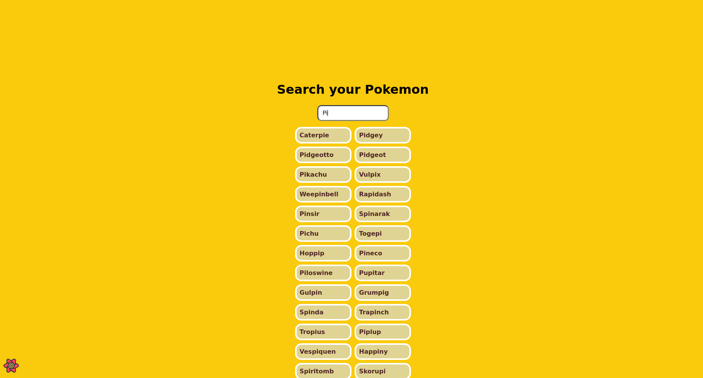

# Next Pokemon

**Next Pokemon** is a web application that allows users to search for Pokémon in the national Pokédex via the official PokeAPI. This app provides detailed information about each Pokémon, such as their types, stats, and more.

## Technologies Used

- **HTML5**: Web page structure.
- **CSS3**: Styles and layout of the application.
- **Next.js**: React framework for server-side rendering and page management.
- **React**: JavaScript library for building dynamic user interfaces.
- **JavaScript**: Programming language for the app's logic.
- **TypeScript**: A superset of JavaScript that offers static typing to enhance code maintainability and safety.

## Features

- Search for Pokémon by name or Pokédex number.
- View detailed information about each Pokémon (name, type, stats, etc.).
- Responsive and modern user interface.
- Real-time data retrieval from PokeAPI.

## Installation

1. Clone the repository:

   ```bash
   git clone https://github.com/ZAomineZ/next_pokemon.git
   ```
   
2. Navigate to the project folder:

   ```bash
   cd next_pokemon
   ```
3. Install the dependencies using npm or yarn:
    ```bash
    npm i
    ```
4. Start the app in development mode:
    ```bash
    npm run dev
    ```

The application will be available at http://localhost:3000.

## Example



---